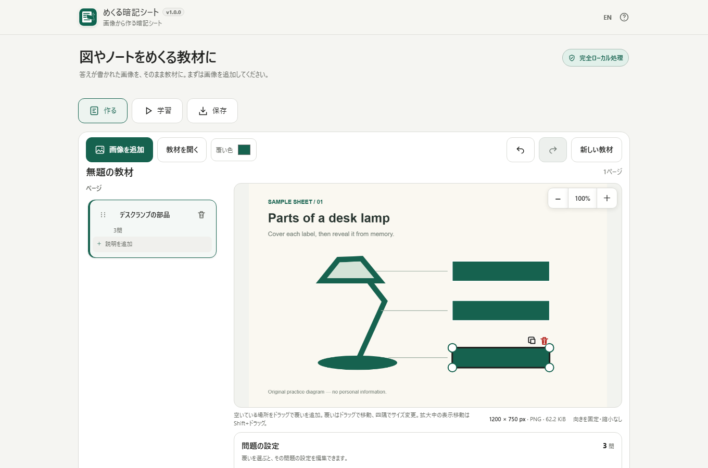

# Reveal Sheet / めくる暗記シート

[](https://github.com/ttomohisa/htmlapps-reveal-sheet/actions/workflows/test-app.yml)
[](https://github.com/ttomohisa/htmlapps-reveal-sheet/actions/workflows/build-standalone.yml)
[](LICENSE)
[](reveal-sheet.html)

[English README](README.md)

答えが書かれた図・写真・スクリーンショット・ノートに覆いを置き、めくって確認するための暗記シートをブラウザだけで作るツールです。自由に答えをめくる学習と、一問ずつ進める学習の両方に対応します。

選択した画像や教材データは端末内で処理します。サーバーへアップロードせず、登録やインストールも必要ありません。




## Features

- **問題の順番を変更** — 答えの覆いを選び、問題欄の「順番を前へ／順番を後ろへ」でページ内の出題順を変更できます。グループは一問のまま移動し、元に戻す／やり直すと両保存形式に対応します。進行中の学習回の順番は維持され、次の回から新しい順番になります。

- **画像上でそのまま覆いを作成** — 答えの範囲をドラッグして覆いを置き、移動・リサイズ・複製・削除・Undo / Redoができます。
- **覆いの色を変更** — 選んだ色は教材に保存され、編集画面と学習画面で共通して使われます。
- **複数の覆いを一問にまとめる** — 関連する答えをまとめてめくれます。ヒントなどは「学習中は隠したまま」にできます。
- **自由にめくる / 一問ずつ** — 好きな答えを開く学習と、「思い出せた / もう一度」で自己評価する学習を選べます。
- **学習中に修正して戻れる** — 一問ずつ学習中に問題を直し、同じ問題・表示位置へ戻れます。
- **複数ページを管理** — ページ名・説明の編集、ドラッグハンドルでの並べ替え、削除、Undoに対応します。スマホではページカードを横カルーセルにして、画像までの縦距離を抑えます。
- **編集用データを保存** — 正規化済み画像・覆い・問題・ページ構成を `.reveal.json` として保存できます。
- **教材HTMLを1ファイルで保存** — 画像と学習画面をまとめた `.reveal.html` を書き出せます。
- **教材HTMLを安全に再編集** — 読み込んだHTML自体は実行せず、固定のJSONデータ部分だけを検証して使います。
- **端末内保存は任意** — 作業の復元と学習進捗の保存は別設定で、どちらも初期OFFです。
- **日本語 / 英語・キーボード対応** — 主要操作はキーボードでも利用できます。

## すぐ使う

### 単一HTMLを使う

1. [`reveal-sheet.html`](reveal-sheet.html) をダウンロードします。
2. 現行のChromeまたはEdgeで開きます。
3. **画像を追加**からJPEG・静止PNG・静止WebPを選びます。
4. 画像上の答えをドラッグして覆いを作ります。
5. 教材ができたら**学習**を開きます。

アカウント、インストール、ローカルサーバー、バックエンドは不要です。

### リポジトリからビルドする

Windows:

```powershell
./build-standalone.bat
```

生成されたアプリは `dist/index.html` に出力されます。自己展開型の単一HTMLは `dist/index.self-extract.html` に生成されます。

## 使い方

1. **画像を追加** — ファイル選択、PCのドラッグ＆ドロップ、画像ファイルの貼り付けに対応します。受け付けた画像は縮小せず、向きを固定したPNGへ正規化します。
2. **覆いを作る** — 答えの範囲をドラッグします。選択中の覆いはそのままドラッグで移動し、四隅のハンドルで大きさを変えます。
3. **ページを整理する** — カード上でページ名と任意説明を編集します。スマホでは横カルーセルを通常どおりスワイプでき、並べ替えはドラッグハンドルからだけ開始します。
4. **問題を組み立てる** — 複数の答えを一問にしたいときは**まとめてめくる**を使います。ヒント等は**学習中は隠したまま**にできます。
5. **学習する** — **自由にめくる**または**一問ずつ**を選びます。一問ずつでは答えを見るまで自己評価できません。
6. **学習中に直す** — **この問題を直す**で編集し、修正後に学習へ戻ります。
7. **保存する** — 編集用の `.reveal.json`、または学習用の単一HTML `.reveal.html` を保存します。
8. **教材を開く** — Reveal SheetのJSONと教材HTMLのどちらも、元画像を選び直さず再読込できます。

### 保存形式

| 形式 | 用途 | 学習結果 |
| --- | --- | --- |
| `.reveal.json` | あとで再編集する | 含めない |
| `.reveal.html` | 1ファイルで学習・共有する | 含めない |

元ファイル名、Undo履歴、現在の表示位置、作者側の学習結果は保存データに含めません。

## スマートフォン

スマートフォンでは**作る / 学習 / 保存**を下部固定ナビで切り替えます。編集画面のページカードは横カルーセルです。カード本体を触っても並べ替えは始まらず、ドラッグハンドルからだけ開始します。

一問ずつ学習では、390 × 760 の回帰テストで、画像と**答えを見る**または評価ボタンが同じ画面内へ入る構成を確認しています。前の問題、飛ばす、この問題を直す、学習を終える等は**その他**へまとめています。

## キーボード操作

### 一問ずつ

| キー | 操作 |
| --- | --- |
| `Space` | 答えを見る |
| `1` | 思い出せた |
| `2` | もう一度 |
| `S` | 飛ばす |
| `←` | 前の問題 |

### 選択した覆い

| キー | 操作 |
| --- | --- |
| 矢印キー | 画像上で1 px移動 |
| `Shift` + 矢印 | 10 px移動 |
| `Alt` + 矢印 | サイズ変更 |

ページ並べ替え用ハンドルも矢印キーで移動できます。

## プライバシー / 外部通信

Reveal Sheetは端末内処理を前提にしています。

- 選択した画像と教材データはブラウザ内で処理します。
- 実行時CDN、外部フォント、analytics、広告、外部APIは使用しません。
- CSPは `connect-src 'none'` です。
- 教材HTMLには画像・CSS・SVG・必要なJavaScriptを内包し、開いた後の追加通信を必要としません。
- 作業の端末内保存は明示的にONにした場合だけIndexedDBを使います。
- 学習進捗の端末内保存は別設定で、こちらも初期OFFです。

**覆いは暗記用であり、墨消しではありません。** 編集用データや教材HTMLには元画像の画素と答えが残ります。機密情報の削除には使用しないでください。

## 対応形式と上限

対応画像:

- JPEG
- 静止PNG
- 静止WebP

GIF、APNG、アニメーションWebP、SVG、HEIC / HEIF、AVIF、PDF、URL指定画像には対応していません。

| 項目 | 上限 |
| --- | ---: |
| 入力画像 | 20 MiB |
| 縦 / 横 | 各8192 px |
| 1画像の総画素数 | 16,000,000 |
| 正規化後PNG | 1画像32 MiB |
| 1教材の画像 | 合計64 MiB |
| ページ | 30 |
| 覆い | 合計1,000 / 1ページ200 |
| 問題 | 合計1,000 / 1問50覆い |
| 編集JSON | 96 MiB |
| 教材HTML | 100 MiB |

これは読み込み拒否の上限です。上限付近の教材がすべての端末で快適に動くことを保証するものではありません。

## ブラウザ対応と制限

主対象はChrome / Edgeです。Windows Chromiumの自動テストでは、スマホ幅、短い横画面、キーボード / アクセシビリティ、外部通信禁止、保存・再読込、設定上限などを確認しています。

現在の制限:

- iPhone / Android実機の確認結果は自動テストには含まれません。
- macOS Safari / Firefoxは正式な確認済み対象としていません。
- OCRは行いません。
- PDF入力には対応しません。
- クラウド同期やアカウント保存はありません。
- ブラウザ保存領域は消去・利用不可になる場合があるため、大事な教材は `.reveal.json` でも保存してください。

確認内容は [docs/QA_RESULTS.md](docs/QA_RESULTS.md)、[docs/QA_MATRIX.md](docs/QA_MATRIX.md)、[docs/MOBILE_ACCESSIBILITY_QA.md](docs/MOBILE_ACCESSIBILITY_QA.md) を参照してください。

## 開発・ビルド

必要環境:

- Node.js 22以上
- リポジトリ検証 / ビルド用のPowerShell 7

リポジトリ検証:

```powershell
pwsh -NoProfile -File ./scripts/check-powershell-syntax.ps1
pwsh -NoProfile -File ./scripts/check-repository.ps1
pwsh -NoProfile -File ./scripts/test-reveal-build.ps1
```

Unit / ブラウザテスト:

```text
npm ci
npm run test:unit
npx playwright install chromium
npm run test:e2e -- --project=chromium
```

`APP_VARIANT=self-extract` を設定すると、自己展開版に対して同じE2Eを実行できます。

主要ファイル:

```text
src/index.template.html       本体テンプレート
src/player.template.html      書き出す教材HTMLのテンプレート
src/reveal/                   Reveal Sheet本体コード
scripts/assemble-reveal.ps1   単一HTML組み立て
scripts/verify-reveal.ps1     単一HTML検証
dist/index.html               生成される可読版
reveal-sheet.html             リポジトリの単一HTML版
```

## リリース状況

**v1.0.1** ではページ内の問題順変更を追加し、覆いの複製でグループ・補助の役割・問題文・答えを引き継ぐよう修正しました。保存形式は引き続きschemaVersion 1です。Android / iPhone実機、実スクリーンリーダー、実際の200%ズーム、OSのファイル受け渡しは、実機で確認するまで未検証として残します。リリース判定の境界はQA資料を参照してください。

## Contributing

不具合報告や機能提案はGitHub Issuesで受け付けます。開発方法は [CONTRIBUTING.md](CONTRIBUTING.md) を参照してください。

## License

Copyright © 2026 ttomohisa

[MIT License](LICENSE) で公開しています。第三者表記は [THIRD_PARTY_NOTICES.md](THIRD_PARTY_NOTICES.md) を参照してください。
