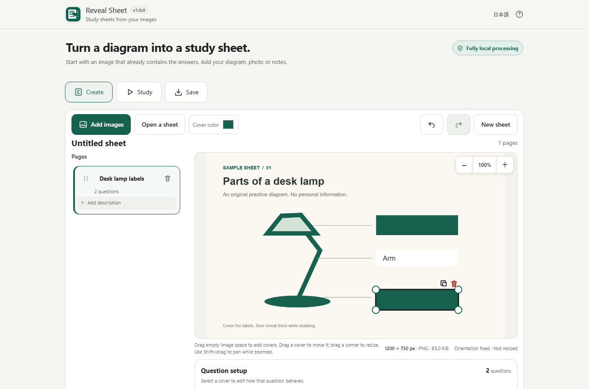
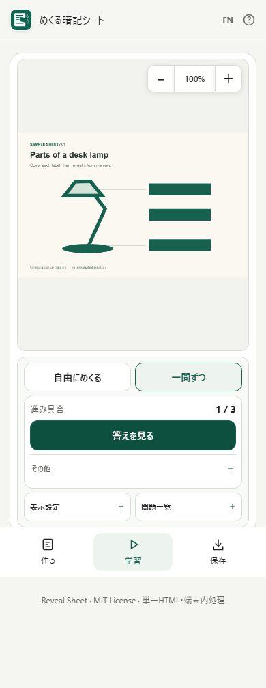

# Reveal Sheet

[](https://github.com/ttomohisa/htmlapps-reveal-sheet/actions/workflows/test-app.yml)
[](https://github.com/ttomohisa/htmlapps-reveal-sheet/actions/workflows/build-standalone.yml)
[](LICENSE)
[](reveal-sheet.html)

[日本語版 README](README.ja.md)

Reveal Sheet is a browser-only study-sheet maker for diagrams, photos, screenshots, and notes that already contain answers. Add opaque covers over the parts you want to recall, then reveal them freely or study one question at a time.

Selected images and saved-sheet data are processed on your device. The app does not upload them to a server and does not require an account or installation.



## Features

- **Create covers directly on an image** — Drag over an answer to place a cover, then move, resize, duplicate, delete, Undo, or Redo it.
- **Choose the cover color** — The selected color is stored with the sheet and used consistently while editing and studying.
- **Turn several covers into one question** — Group related answers so they reveal together, or keep hint areas covered while studying.
- **Study freely or one question at a time** — Reveal any answer manually, or use the guided flow with Recalled / Review again self-assessment.
- **Edit without losing your place** — Fix the current question during guided study and return to the same question and view position.
- **Manage multi-page material** — Rename pages, add optional descriptions, reorder with a drag handle, delete, and Undo. On phones, page cards stay in a horizontal carousel so the image area remains close at hand.
- **Save an editable sheet** — Export a `.reveal.json` file that contains normalized images, covers, questions, and page structure.
- **Share a self-contained lesson** — Export a `.reveal.html` file that contains the images and study player in one HTML file.
- **Reopen Reveal Sheet lessons safely** — Imported lesson HTML is read as text; only the fixed non-executing JSON data block is validated and used.
- **Optional local persistence** — Work recovery and study-progress storage are separate, OFF by default, and stored in the browser only when enabled.
- **Japanese / English and keyboard support** — Major controls are keyboard-operable, with dedicated shortcuts for guided study.

## Quick start

### Use the standalone HTML

1. Download [`reveal-sheet.html`](reveal-sheet.html).
2. Open it in a current Chrome or Edge browser.
3. Choose **Add images** and select JPEG, static PNG, or static WebP files.
4. Drag over an answer in the image to create a cover.
5. Open **Study** when the sheet is ready.

No account, installation, local server, or backend is required.

### Build from the repository

On Windows:

```powershell
./build-standalone.bat
```

The generated app is written to `dist/index.html`. A self-extracting single-HTML build is also generated at `dist/index.self-extract.html`.

## Usage

1. **Add images** — Use the file picker, desktop drag-and-drop, or paste an image file. Accepted images are normalized to orientation-fixed PNG without resizing.
2. **Create covers** — Drag over each answer. Drag a selected cover to move it and use the corner handles to resize it.
3. **Organize pages** — Edit page names and optional descriptions directly in the cards. On mobile, swipe the horizontal card carousel normally and start reordering only from the drag handle.
4. **Build questions** — Select several answer covers and choose **Reveal together** when they should behave as one question. Use **Keep covered while studying** for auxiliary hint covers.
5. **Study** — Choose **Reveal freely** or **One at a time**. Guided study requires the answer to be revealed before it can be rated.
6. **Correct while studying** — Use **Edit this question**, make the change, then return to study.
7. **Save** — Export editable data as `.reveal.json`, or export a self-contained study lesson as `.reveal.html`.
8. **Open a sheet** — Reopen either Reveal Sheet JSON or Reveal Sheet lesson HTML without reselecting the source images.

### Save formats

| Format | Purpose | Contains study results? |
| --- | --- | --- |
| `.reveal.json` | Re-edit the sheet later | No |
| `.reveal.html` | Study/share as one self-contained HTML file | No |

Original filenames, Undo history, current view position, and the author's study results are not included in exported sheet data.

## Mobile behavior

On smartphones, **Create / Study / Save** is shown as a bottom navigation. The editor keeps page cards in a horizontal carousel; touching the card itself does not start a reorder, while the drag handle does.

Guided study is compacted so the image and the primary action — **Reveal answer** or the rating buttons — fit together on a 390 × 760 viewport in the automated regression suite. Secondary actions such as Previous, Skip, Edit this question, and Finish study are kept under **More**.



## Keyboard shortcuts

### Guided study

| Shortcut | Action |
| --- | --- |
| `Space` | Reveal the current answer |
| `1` | Recalled |
| `2` | Review again |
| `S` | Skip |
| `←` | Previous question |

### Selected cover

| Shortcut | Action |
| --- | --- |
| Arrow key | Move by 1 image pixel |
| `Shift` + Arrow | Move by 10 image pixels |
| `Alt` + Arrow | Resize |

The page reorder handle also supports arrow-key movement.

## Privacy and runtime network protection

Reveal Sheet is designed for local processing.

- Selected images and sheet data are processed in the browser.
- There are no runtime CDNs, remote fonts, analytics, ads, or external APIs.
- The app CSP uses `connect-src 'none'`.
- Exported lesson HTML embeds its images, CSS, SVG, and required JavaScript and does not need additional network requests after opening.
- Optional work recovery uses IndexedDB only after explicit opt-in.
- Optional study-progress persistence is separate and also OFF by default.

**The covers are for studying, not redaction.** The original image pixels and answers remain inside editable or lesson files. Do not use Reveal Sheet to remove confidential information from an image.

## Supported input and safety limits

Supported image input:

- JPEG
- Static PNG
- Static WebP

Unsupported input includes GIF, APNG, animated WebP, SVG, HEIC / HEIF, AVIF, PDF, and URL-based images.

| Item | Limit |
| --- | ---: |
| Input image | 20 MiB |
| Dimensions | 8192 px per side |
| Total pixels per image | 16,000,000 |
| Normalized PNG | 32 MiB per image |
| Images in one sheet | 64 MiB total |
| Pages | 30 |
| Covers | 1,000 total / 200 per page |
| Questions | 1,000 total / 50 covers per question |
| Editable JSON | 96 MiB |
| Lesson HTML | 100 MiB |

These are rejection limits, not a guarantee that every device can comfortably handle material near the maximum.

## Browser support and limitations

Chrome and Edge are the primary targets. Automated Windows Chromium tests cover mobile-width layouts, short landscape layouts, keyboard/accessibility contracts, offline/network restrictions, save/reopen flows, and configured resource ceilings.

Current limitations:

- Physical iPhone / Android device testing is not represented by the automated suite.
- macOS Safari and Firefox are not yet treated as verified release targets.
- Reveal Sheet does not perform OCR.
- PDF input is not supported.
- There is no cloud sync or account-based storage.
- Browser storage can be cleared or become unavailable, so important work should also be kept as exported `.reveal.json`.

See [docs/QA_RESULTS.md](docs/QA_RESULTS.md), [docs/QA_MATRIX.md](docs/QA_MATRIX.md), and [docs/MOBILE_ACCESSIBILITY_QA.md](docs/MOBILE_ACCESSIBILITY_QA.md) for verification details.

## Development and build

Requirements:

- Node.js 22 or later
- PowerShell 7 for the repository checks/build scripts

Repository checks:

```powershell
pwsh -NoProfile -File ./scripts/check-powershell-syntax.ps1
pwsh -NoProfile -File ./scripts/check-repository.ps1
pwsh -NoProfile -File ./scripts/test-reveal-build.ps1
```

Unit and browser tests:

```text
npm ci
npm run test:unit
npx playwright install chromium
npm run test:e2e -- --project=chromium
```

Set `APP_VARIANT=self-extract` to run the same E2E suite against the self-extracting build.

Important source locations:

```text
src/index.template.html       Main app template
src/player.template.html      Exported lesson template
src/reveal/                   Reveal Sheet application code
scripts/assemble-reveal.ps1   Standalone assembler
scripts/verify-reveal.ps1     Standalone verification
dist/index.html               Generated readable standalone app
reveal-sheet.html             Repository standalone app
```

## Release status

The application version is **v1.0.0**, but this branch remains a release candidate until the required physical-device paths are actually verified. Automated regression, save compatibility, build artifacts, documentation, and screenshots are frozen here; unperformed Android / iPhone / Safari / Firefox checks are not reported as passed.

## Contributing

Bug reports and feature proposals are welcome through GitHub Issues. See [CONTRIBUTING.md](CONTRIBUTING.md) for development guidance.

## License

Copyright © 2026 ttomohisa

Licensed under the [MIT License](LICENSE). See [THIRD_PARTY_NOTICES.md](THIRD_PARTY_NOTICES.md) for third-party notices.
